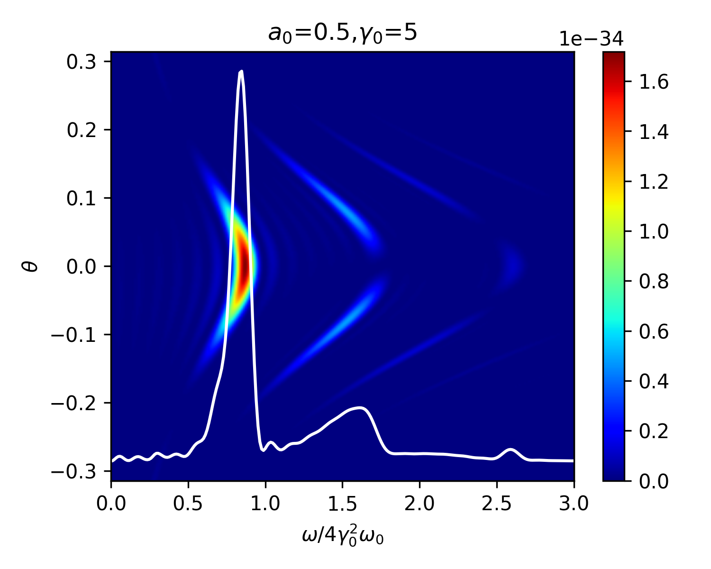

## 安装方法
---
克隆仓库
```bash
git clone http://172.16.95.131/gengxs/pylw.git
```

用户安装
```bash
cd pylw
# editable install
pip install --user -e .
```

直接安装
```bash
pip install --user git+http://172.16.95.131/gengxs/pylw.git
```

## 用法
---
这里以Smilei输出的轨迹为例
```python
import h5py

um = 1e-6
fs = 1e-15

l0 = 0.8*um
omega0 = 2*pi*c / l0

# 读取h5文件中的第0条轨迹
with h5py.File("tests/test.h5", "r") as f:
    # 坐标xyz和时间t换算为国际单位
    x = f['x'][:, 0] / 2/pi * l0
    y = f['y'][:, 0] / 2/pi * l0
    z = f['z'][:, 0] / 2/pi * l0
    ux = f['px'][:, 0]
    uy = f['py'][:, 0]
    uz = f['pz'][:, 0]
    t = np.arange(len(ux)) * f.attrs['dt'] / 2/pi * l0/c
```

### 直接计算辐射谱
```python
from lw import get_lw_spectrum

# 用于确定角度范围
gamma0 = 5.0
theta_max = pi/2/gamma0
omega_max = 4*gamma0**2 * omega0 * 3

ntheta = 256
nomega = 256

theta_axis = np.linspace(-theta_max, theta_max, ntheta)
omega_axis = np.linspace(0, omega_max, nomega) 

I = np.zeros((ntheta, nomega))

for itheta, theta in enumerate(theta_axis):
    # 方向矢量
    n = [np.cos(theta), 0, np.sin(theta)]
    I[itheta, :] = get_lw_spectrum(x, y, z, ux, uy, uz, t, n, omega_axis)
```
作图
```python
fig, ax = plt.subplots(
    1, 1,
    tight_layout = True,
    figsize=(5, 4),
)


h = ax.pcolormesh(
    omega_axis/(4*gamma0**2*omega0), theta_axis,
    I,
    cmap='jet',
    shading='gouraud',
)
fig.colorbar(h, ax=ax)

axr = ax.twinx()
axr.plot(
    omega_axis/(4*gamma0**2*omega0), 
    I.sum(axis=0),
    color='w',
)
axr.set_yticks([])

ax.set_xlabel(r'$\omega/4\gamma_0^2\omega_0$')
ax.set_ylabel(r'$\theta$')
ax.set_title(rf'$a_0$={a0},$\gamma_0$={gamma0}')
```

结果对比[Richard (2012)](https://doi.org/10.5281/zenodo.843510) Figure 2.7(a)

### 计算辐射电场$R\cdot \bf{E}$
```python
from lw import get_lw_RE

t_ret, REx, REy, REz = get_lw_RE(x, y, z, ux, uy, uz, t, n)
```

### 由$R\cdot \bf{E}$计算辐射谱
```python
from lw import get_RE_spectrum

I = np.zeros(len(omega_axis))
for RE in (REx, REy, REz):
    RE_ft = get_RE_spectrum(RE, t_ret, omega_axis)
    I += RE_ft.real**2 + RE_ft.imag**2
I *= 2
```

## 参考文献
Richard (2012) ([DOI: 10.5281/zenodo.843510](https://doi.org/10.5281/zenodo.843510)) (2.32)、(2.36)、(2.39)式